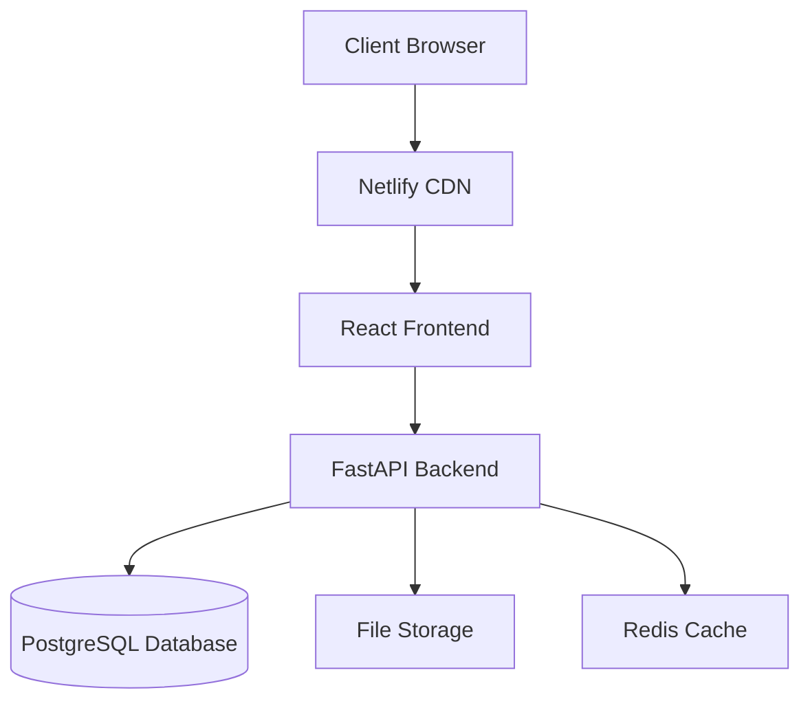

# BrandFlow Documentation

## 📋 Table of Contents

- [1. Project Overview](#1-project-overview)
- [2. System Architecture](#2-system-architecture)
- [3. API Documentation](./api/README.md)
- [4. Frontend Components](./frontend/README.md)
- [5. Database Models](./database/README.md)
- [6. Configuration & Deployment](./deployment/README.md)
- [7. Troubleshooting](./troubleshooting/README.md)
- [8. Development Guide](./development/README.md)

## 1. Project Overview

BrandFlow is a comprehensive campaign management system designed for marketing agencies and their clients. It provides a complete solution for managing marketing campaigns, purchase requests, user management, and analytics.

### Key Features

- **Campaign Management**: Create, edit, and track marketing campaigns
- **User Management**: Role-based access control (Super Admin, Agency Admin, Staff, Client)
- **Purchase Request System**: Request and approval workflow
- **Analytics Dashboard**: Real-time performance metrics
- **File Management**: Logo and document upload/management
- **Notification System**: Real-time notifications and alerts
- **Export Functionality**: Data export to various formats
- **Multi-tenant Architecture**: Support for multiple agencies and clients

### Technology Stack

#### Frontend
- **Framework**: React 18.2.0
- **Build Tool**: Vite 5.2.0
- **Styling**: Tailwind CSS 3.4.7
- **Routing**: React Router DOM 6.23.1
- **Icons**: Lucide React 0.416.0
- **Deployment**: Netlify

#### Backend
- **Framework**: FastAPI 0.104.1
- **Database**: PostgreSQL (Production), SQLite (Development)
- **ORM**: SQLAlchemy 2.0.23
- **Authentication**: JWT with PyJWT 2.8.0
- **File Storage**: Local filesystem with Pillow 10.1.0
- **Task Scheduling**: APScheduler 3.10.4
- **Deployment**: Railway

### Project Structure

```
BrandFlow/
├── brandflow-fix/          # Frontend React Application
│   ├── src/
│   │   ├── components/     # Reusable UI components
│   │   ├── pages/          # Page components
│   │   ├── contexts/       # React contexts
│   │   ├── hooks/          # Custom React hooks
│   │   ├── utils/          # Utility functions
│   │   └── api/            # API client
│   ├── public/             # Static assets
│   └── docs/               # Documentation
└── brandflow-fastapi/      # Backend FastAPI Application
    ├── app/
    │   ├── api/            # API endpoints
    │   ├── models/         # Database models
    │   ├── schemas/        # Pydantic schemas
    │   ├── services/       # Business logic services
    │   ├── core/           # Core configurations
    │   └── middleware/     # Custom middleware
    └── scripts/            # Deployment scripts
```

## 2. System Architecture

### High-Level Architecture



### Component Architecture

#### Frontend Architecture
- **Component-based Architecture**: Reusable React components
- **Context-based State Management**: React Context for global state
- **Lazy Loading**: Dynamic imports for better performance
- **Role-based Routing**: Different UI layouts for different user roles

#### Backend Architecture
- **Layered Architecture**: API → Service → Model layers
- **Dependency Injection**: FastAPI's dependency system
- **Middleware Stack**: CORS, Authentication, Performance monitoring
- **Database Abstraction**: SQLAlchemy ORM with async support

### Security Architecture

- **Authentication**: JWT-based token authentication
- **Authorization**: Role-based access control (RBAC)
- **Data Validation**: Pydantic models for request/response validation
- **CORS Protection**: Configured for specific allowed origins
- **SQL Injection Prevention**: SQLAlchemy ORM protection
- **Password Security**: bcrypt hashing

## Quick Start

### Prerequisites

- Node.js ≥ 18.0.0
- Python ≥ 3.8
- PostgreSQL (for production)

### Frontend Setup

```bash
cd brandflow-fix
npm install
npm run dev
```

The frontend will be available at `http://localhost:5173`

### Backend Setup

```bash
cd brandflow-fastapi
pip install -r requirements.txt
python main.py
```

The backend will be available at `http://localhost:8000`

### Default Login Credentials

#### Super Admin
- Email: `admin@brandflow.com`
- Password: `admin123`

#### Client User
- Email: `client@example.com`
- Password: `client123`

## Documentation Sections

### [API Documentation](./api/README.md)
Complete API reference with endpoint details, request/response schemas, and examples.

### [Frontend Components](./frontend/README.md)
Detailed guide to React components, their props, usage examples, and customization.

### [Database Models](./database/README.md)
Database schema documentation, relationships, and data flow.

### [Configuration & Deployment](./deployment/README.md)
Environment setup, configuration options, and deployment guides for Netlify and Railway.

### [Troubleshooting](./troubleshooting/README.md)
Common issues, error messages, and their solutions.

### [Development Guide](./development/README.md)
Guidelines for contributing, coding standards, and development workflow.

## Support

For questions, issues, or contributions, please refer to the troubleshooting guide or contact the development team.

## Version Information

- **Frontend Version**: 1.0.0
- **Backend Version**: 2.3.0
- **Documentation Version**: 1.0.0
- **Last Updated**: 2025-09-14