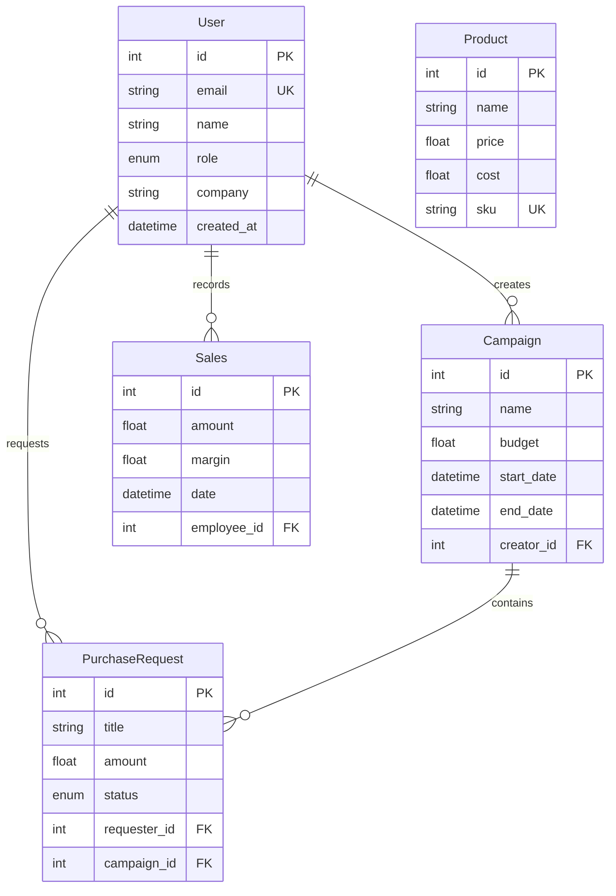

# Database Models & Schema Documentation

## Overview

BrandFlow uses SQLAlchemy ORM with support for both SQLite (development) and PostgreSQL (production). The database follows a relational model with proper foreign key constraints and timestamps.

## Database Configuration

### Development (SQLite)
- **File**: Local SQLite database file
- **Location**: Application root directory
- **Features**: Simple file-based storage, no setup required

### Production (PostgreSQL)
- **Provider**: Railway PostgreSQL
- **Features**: ACID compliance, concurrent access, advanced indexing
- **Connection**: Via DATABASE_URL environment variable

## Core Models

### 1. User Model (`app/models/user.py`)

Represents system users with role-based access control.

**Table Name**: `users`

**Columns:**
| Column | Type | Constraints | Description |
|--------|------|-------------|-------------|
| id | Integer | Primary Key, Auto Increment | Unique user identifier |
| name | String(100) | NOT NULL | User's full name |
| email | String(255) | UNIQUE, NOT NULL, Indexed | User's email address |
| hashed_password | String(255) | NOT NULL | Bcrypt hashed password |
| role | Enum(UserRole) | NOT NULL | User role (권한 수준) |
| company | String(200) | Optional | Company name |
| contact | String(50) | Optional | Contact information |
| incentive_rate | Float | Default: 0.0 | Commission rate |
| status | Enum(UserStatus) | Default: INACTIVE | Account status |
| is_active | Boolean | Default: True | Active flag |
| created_at | DateTime | Auto-set | Creation timestamp |
| updated_at | DateTime | Auto-update | Last update timestamp |

**Enums:**

```python
class UserRole(str, enum.Enum):
    SUPER_ADMIN = "슈퍼 어드민"
    AGENCY_ADMIN = "대행사 어드민"
    STAFF = "직원"
    CLIENT = "클라이언트"

class UserStatus(str, enum.Enum):
    ACTIVE = "활성"
    INACTIVE = "휴면"
    BANNED = "차단"
```

**Relationships:**
- **campaigns**: One-to-many with Campaign (as creator)
- **purchase_requests**: One-to-many with PurchaseRequest (as requester)
- **sales_records**: One-to-many with Sales (as employee)

**Indexes:**
- Primary key on `id`
- Unique index on `email`

### 2. Campaign Model (`app/models/campaign.py`)

Represents marketing campaigns with budget and timeline tracking.

**Table Name**: `campaigns`

**Columns:**
| Column | Type | Constraints | Description |
|--------|------|-------------|-------------|
| id | Integer | Primary Key, Auto Increment | Unique campaign identifier |
| name | String(200) | NOT NULL | Campaign name |
| description | Text | Optional | Campaign description |
| client_company | String(200) | NOT NULL | Client company name |
| budget | Float | NOT NULL | Campaign budget |
| start_date | DateTime | NOT NULL | Campaign start date |
| end_date | DateTime | NOT NULL | Campaign end date |
| status | Enum(CampaignStatus) | Default: DRAFT | Campaign status |
| creator_id | Integer | Foreign Key to users.id | Campaign creator |
| created_at | DateTime | Auto-set | Creation timestamp |
| updated_at | DateTime | Auto-update | Last update timestamp |

**Enums:**

```python
class CampaignStatus(str, enum.Enum):
    DRAFT = "초안"
    ACTIVE = "진행중"
    COMPLETED = "완료"
    CANCELLED = "취소"
```

**Relationships:**
- **creator**: Many-to-one with User
- **purchase_requests**: One-to-many with PurchaseRequest

**Properties:**
- `creator_name`: Returns creator's name
- `client_name`: Returns client company name

**Indexes:**
- Primary key on `id`
- Foreign key index on `creator_id`

### 3. PurchaseRequest Model (`app/models/purchase_request.py`)

Represents purchase requests with approval workflow.

**Table Name**: `purchase_requests`

**Columns:**
| Column | Type | Constraints | Description |
|--------|------|-------------|-------------|
| id | Integer | Primary Key, Auto Increment | Unique request identifier |
| title | String(200) | NOT NULL | Request title |
| description | Text | Optional | Request description |
| amount | Float | NOT NULL | Request amount |
| quantity | Integer | Default: 1 | Item quantity |
| vendor | String(200) | Optional | Vendor information |
| status | Enum(RequestStatus) | Default: PENDING | Request status |
| requester_id | Integer | Foreign Key to users.id | Request creator |
| campaign_id | Integer | Foreign Key to campaigns.id | Related campaign |
| created_at | DateTime | Auto-set | Creation timestamp |
| updated_at | DateTime | Auto-update | Last update timestamp |

**Enums:**

```python
class RequestStatus(str, enum.Enum):
    PENDING = "대기"
    APPROVED = "승인"
    REJECTED = "거절"
    COMPLETED = "완료"
```

**Relationships:**
- **requester**: Many-to-one with User
- **campaign**: Many-to-one with Campaign (optional)

**Indexes:**
- Primary key on `id`
- Foreign key index on `requester_id`
- Foreign key index on `campaign_id`

### 4. Product Model (`app/models/product.py`)

Represents products/services offered by the agency.

**Table Name**: `products`

**Columns:**
| Column | Type | Constraints | Description |
|--------|------|-------------|-------------|
| id | Integer | Primary Key, Auto Increment | Unique product identifier |
| name | String(200) | NOT NULL | Product name |
| description | Text | Optional | Product description |
| price | Float | NOT NULL | Selling price |
| cost | Float | NOT NULL | Cost price |
| category | String(100) | Optional | Product category |
| sku | String(50) | UNIQUE, Optional | Stock keeping unit |
| is_active | Boolean | Default: True | Active flag |
| created_at | DateTime | Auto-set | Creation timestamp |
| updated_at | DateTime | Auto-update | Last update timestamp |

**Indexes:**
- Primary key on `id`
- Unique index on `sku`

### 5. WorkType Model (`app/models/work_type.py`)

Defines different types of work/services.

**Table Name**: `work_types`

**Columns:**
| Column | Type | Constraints | Description |
|--------|------|-------------|-------------|
| id | Integer | Primary Key, Auto Increment | Unique work type identifier |
| name | String(100) | NOT NULL, UNIQUE | Work type name |
| description | Text | Optional | Work type description |
| is_active | Boolean | Default: True | Active flag |
| created_at | DateTime | Auto-set | Creation timestamp |
| updated_at | DateTime | Auto-update | Last update timestamp |

**Indexes:**
- Primary key on `id`
- Unique index on `name`

### 6. Sales Model (`app/models/sales.py`)

Tracks sales transactions and revenue.

**Table Name**: `sales`

**Columns:**
| Column | Type | Constraints | Description |
|--------|------|-------------|-------------|
| id | Integer | Primary Key, Auto Increment | Unique sales identifier |
| amount | Float | NOT NULL | Sales amount |
| margin | Float | Default: 0.0 | Profit margin |
| date | DateTime | NOT NULL | Sales date |
| description | Text | Optional | Sales description |
| employee_id | Integer | Foreign Key to users.id | Sales employee |
| created_at | DateTime | Auto-set | Creation timestamp |
| updated_at | DateTime | Auto-update | Last update timestamp |

**Relationships:**
- **employee**: Many-to-one with User

### 7. CompanyLogo Model (`app/models/company_logo.py`)

Stores company logo information.

**Table Name**: `company_logos`

**Columns:**
| Column | Type | Constraints | Description |
|--------|------|-------------|-------------|
| id | Integer | Primary Key, Auto Increment | Unique logo identifier |
| filename | String(255) | NOT NULL | Logo filename |
| file_path | String(500) | NOT NULL | Logo file path |
| content_type | String(100) | NOT NULL | File MIME type |
| file_size | Integer | NOT NULL | File size in bytes |
| is_active | Boolean | Default: True | Active flag |
| created_at | DateTime | Auto-set | Upload timestamp |
| updated_at | DateTime | Auto-update | Last update timestamp |

## Base Models

### TimestampMixin (`app/models/base.py`)

Provides automatic timestamp functionality for all models.

**Columns:**
- `created_at`: Automatically set on creation
- `updated_at`: Automatically updated on modification

**Usage:**
```python
class MyModel(Base, TimestampMixin):
    # Model definition
    pass
```

### Base Class

All models inherit from SQLAlchemy's `Base` class:

```python
from sqlalchemy.ext.declarative import declarative_base
Base = declarative_base()
```

## Relationships & Foreign Keys

### Entity Relationship Diagram



### Key Relationships

1. **User → Campaign**: One user can create multiple campaigns
2. **User → PurchaseRequest**: One user can make multiple purchase requests
3. **Campaign → PurchaseRequest**: One campaign can have multiple purchase requests
4. **User → Sales**: One user (employee) can record multiple sales

### Foreign Key Constraints

All foreign keys are properly configured with:
- **ON DELETE**: Restrict (prevents deletion if referenced)
- **ON UPDATE**: Cascade (updates references when key changes)

## Database Initialization

### Initial Data Setup (`app/db/init_data.py`)

The system creates default data on first run:

**Default Users:**
- Super Admin: `admin@brandflow.com` / `admin123`
- Agency Admin: `agency@brandflow.com` / `agency123`
- Staff: `staff@brandflow.com` / `staff123`
- Client: `client@example.com` / `client123`

**Default Work Types:**
- 웹 개발 (Web Development)
- 모바일 앱 개발 (Mobile App Development)
- 디자인 (Design)
- 마케팅 (Marketing)
- 컨설팅 (Consulting)

**Default Products:**
- 웹사이트 제작 (Website Creation)
- 모바일 앱 개발 (Mobile App Development)
- 브랜드 디자인 (Brand Design)
- 디지털 마케팅 (Digital Marketing)

### Database Migration

The application uses Alembic for database migrations:

```bash
# Generate migration
alembic revision --autogenerate -m "Description"

# Apply migrations
alembic upgrade head

# Downgrade (if needed)
alembic downgrade -1
```

## Performance Optimization

### Database Indexes (`app/db/indexes.py`)

**Primary Indexes:**
- All primary keys have automatic indexes
- Unique constraints create indexes
- Foreign keys have indexes

**Custom Indexes:**
- User email (unique)
- Campaign dates (range queries)
- Purchase request status (filtering)
- Sales date (time-based queries)

### Query Optimization (`app/db/query_optimizer.py`)

**Strategies:**
- **Eager Loading**: Use `joinedload()` for relationships
- **Lazy Loading**: Default for optional relationships
- **Batch Loading**: For N+1 query prevention
- **Query Limits**: Pagination for large datasets

**Example Optimized Query:**
```python
# Efficient campaign loading with creator info
campaigns = await db.execute(
    select(Campaign)
    .options(joinedload(Campaign.creator))
    .where(Campaign.status == CampaignStatus.ACTIVE)
    .limit(10)
)
```

## Data Validation

### Pydantic Schemas (`app/schemas/`)

All API endpoints use Pydantic schemas for validation:

**User Schema Example:**
```python
class UserCreate(BaseModel):
    name: str = Field(..., min_length=1, max_length=100)
    email: EmailStr
    password: str = Field(..., min_length=6)
    role: UserRole
    company: Optional[str] = None
```

**Campaign Schema Example:**
```python
class CampaignCreate(BaseModel):
    name: str = Field(..., min_length=1, max_length=200)
    description: Optional[str] = None
    client_company: str = Field(..., min_length=1)
    budget: float = Field(..., gt=0)
    start_date: datetime
    end_date: datetime
```

## Security Considerations

### Password Security
- **Hashing**: bcrypt with salt
- **Minimum Length**: 6 characters (configurable)
- **Storage**: Never store plain text passwords

### Data Integrity
- **Foreign Key Constraints**: Prevent orphaned records
- **NOT NULL Constraints**: Ensure required data
- **Unique Constraints**: Prevent duplicates
- **Check Constraints**: Data range validation

### Audit Trail
- **Timestamps**: All models track creation/update times
- **User Tracking**: Track who created/modified records
- **Status History**: Track status changes

## Backup & Recovery

### Development (SQLite)
- **Backup**: Copy database file
- **Recovery**: Replace database file
- **Migration**: Export/import data

### Production (PostgreSQL)
- **Automated Backups**: Railway automatic backups
- **Point-in-time Recovery**: Transaction log replay
- **Manual Backup**: `pg_dump` utility

**Backup Command:**
```bash
pg_dump $DATABASE_URL > backup.sql
```

**Restore Command:**
```bash
psql $DATABASE_URL < backup.sql
```

## Common Query Patterns

### User Queries
```python
# Get active users by role
users = await db.execute(
    select(User)
    .where(User.is_active == True)
    .where(User.role == UserRole.STAFF)
)

# Get user with campaigns
user = await db.execute(
    select(User)
    .options(joinedload(User.campaigns))
    .where(User.id == user_id)
)
```

### Campaign Queries
```python
# Get active campaigns with creator
campaigns = await db.execute(
    select(Campaign)
    .options(joinedload(Campaign.creator))
    .where(Campaign.status == CampaignStatus.ACTIVE)
    .order_by(Campaign.start_date.desc())
)

# Get campaigns by date range
campaigns = await db.execute(
    select(Campaign)
    .where(Campaign.start_date >= start_date)
    .where(Campaign.end_date <= end_date)
)
```

### Purchase Request Queries
```python
# Get pending requests with requester
requests = await db.execute(
    select(PurchaseRequest)
    .options(joinedload(PurchaseRequest.requester))
    .where(PurchaseRequest.status == RequestStatus.PENDING)
    .order_by(PurchaseRequest.created_at.desc())
)

# Get requests by campaign
requests = await db.execute(
    select(PurchaseRequest)
    .where(PurchaseRequest.campaign_id == campaign_id)
)
```

## Database Maintenance

### Regular Tasks
- **Index Maintenance**: Monitor and rebuild indexes
- **Statistics Update**: Keep query planner statistics current
- **Cleanup**: Remove old data per retention policy
- **Backup Verification**: Test backup integrity

### Monitoring
- **Connection Pool**: Monitor active connections
- **Query Performance**: Identify slow queries
- **Disk Usage**: Monitor storage growth
- **Lock Contention**: Identify blocking queries

### Health Checks
The system provides database health check endpoints:
- `GET /api/system/health`: Basic connectivity
- `GET /api/monitoring/system`: Detailed metrics
- Database connection status
- Query performance metrics